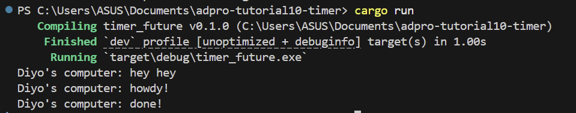
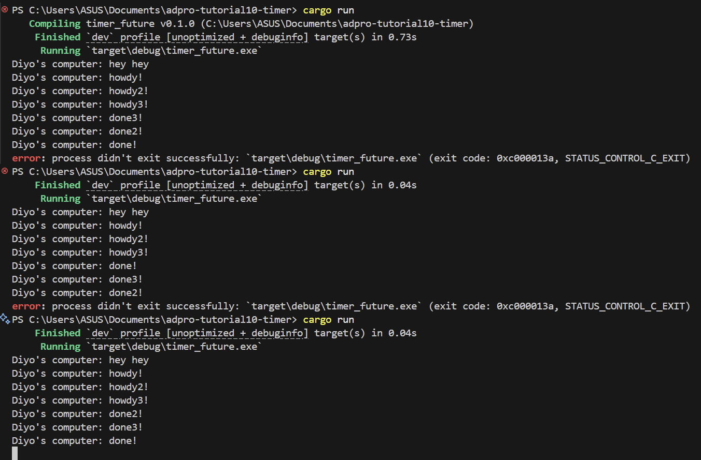
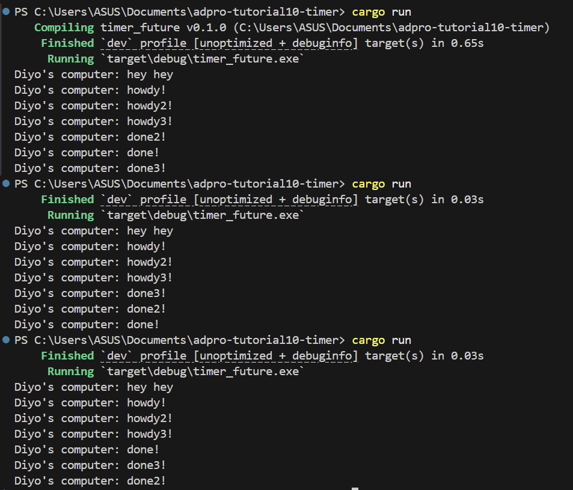

# Understanding how it works

The println!("hey hey") runs immediately on the main thread before any spawned future is polled. Calling spawner.spawn only pushes the async block into the executor’s queue; it does not run its body right away. When executor.run begins, it dequeues and polls the future, causing “howdy!” to print, then the timer returns Poll::Pending and the future re-queues itself. After two seconds the timer thread wakes the task via its stored waker, executor.run polls it again, and “done!” is printed.

### Removing drop(spawner);

The three “howdy!” messages always appear in the exact 1,2,3 order because each async block prints immediately when it’s first polled. The three “done!” messages come from three independent timer threads that each sleep for two seconds and then wake their tasks at slightly different moments, so their completion prints arrive in a non-deterministic order. Because you never drop the spawner, the executor’s receive loop never sees the channel close and continues blocking for new tasks after all timers have fired, forcing you to manually stop the program.

### With drop(spawner);

The three “howdy!” lines always print in the order you spawned them because each async block runs its first println! immediately, one after the other. The three “done!” lines, on the other hand, come from three independent timer threads that each sleep for two seconds. Because those threads wake up at slightly different times, they call their wakers in a non-predetermined order, and the executor prints “done!” in whatever order those wake-ups arrive.